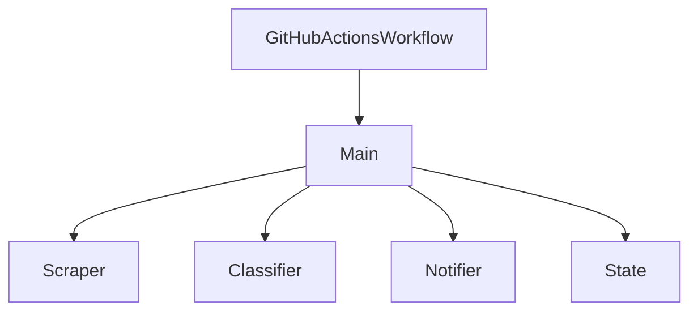

## 1. Stack
- Python 3.12 (per README's GitHub Actions setup step), stdlib `argparse`/`json`/`pathlib`.
- `requests>=2.31` — HTTP fetch of the notices page (requirements.txt).
- `beautifulsoup4>=4.12` — HTML parsing (requirements.txt).
- GitHub Models API (via built-in `GITHUB_TOKEN`) for AI classification (README).
- Telegram Bot API for delivery (README).

## 2. Directory map
| path | what lives there |
|---|---|
| `src/main.py` | orchestrator: env loading, state I/O, outage handling, run flow, CLI (`--dry-run`/`--test`/`--threshold`/`--state-dir`) |
| `src/scraper.py` | `fetch_notices()` — reads AIUB notices listing (README) |
| `src/classifier.py` | `classify()`, `CATEGORY_EMOJI`, `CATEGORIES`, `_KEYWORDS`, `DEFAULT_MODEL` (README "Customize" table) |
| `src/notifier.py` | `send_notice()`, `send_test()`, `send_outage_alert()`, `send_recovery()`, `format_message()` (main.py imports; README) |
| `state/seen.json` | persisted set of seen notice URLs (`seen_urls`, `count`) |
| `state/last_check.txt` | daily heartbeat date string |
| `state/outage.json` | outage tracking (`since`, `last_attempt`, `last_alert`) — created on demand |
| `.github/workflows/check-notices.yml` | GitHub Actions schedule/dispatch that runs `python src/main.py` (README) |
| `.env.example` | local env var template (not read — out of scope) |
| `requirements.txt` | Python deps (`requests`, `beautifulsoup4`) |

## 3. Diagram

## 4. Component index
- [[GitHubActionsWorkflow]]
- [[Main]]
- [[Scraper]]
- [[Classifier]]
- [[Notifier]]
- [[State]]

## 5. Entry points
- Dev/local: `python src/main.py` (with `--dry-run`, `--test`, `--threshold`, `--state-dir` flags) from REPO_ROOT, per README "Run locally".
- Prod: `.github/workflows/check-notices.yml` runs `python src/main.py` on a schedule and via `workflow_dispatch` (README "Automation").

## 6. Conventions
- `from __future__ import annotations` at top of `src/main.py`.
- Module-level imports of sibling `src/` modules by bare name (`import classifier`, `import notifier`, `from scraper import fetch_notices`) — not package-relative (`src/main.py`).
- Functions typed with return annotations, e.g. `def run(dry_run: bool, state_dir: Path, threshold: int) -> int` (`src/main.py`).
- State files are read defensively: `load_seen`/`load_outage` catch `(json.JSONDecodeError, OSError)` and fall back to empty (`src/main.py`).
- CLI exit codes are meaningful: `0` success/silent-skip, `1` abort (no notices / dry-run outage), `2` missing required env vars (`src/main.py`).
- `state/` directories are created lazily with `mkdir(parents=True, exist_ok=True)` at write time, not up front (`src/main.py`).

## 7. Where things go
- New notice category/keyword: edit `CATEGORIES`, `CATEGORY_EMOJI`, `_KEYWORDS` in `src/classifier.py` (README "Customize").
- Change AI model used for classification: `DEFAULT_MODEL` in `src/classifier.py` (README "Customize").
- Change outgoing message layout: `format_message()` in `src/notifier.py` (README "Customize").
- Change check schedule: the four `cron:` lines in `.github/workflows/check-notices.yml` (README "Customize").
- Change flood-guard threshold: `--threshold` flag or `DEFAULT_FLOOD_THRESHOLD` in `src/main.py` (README "Customize").
